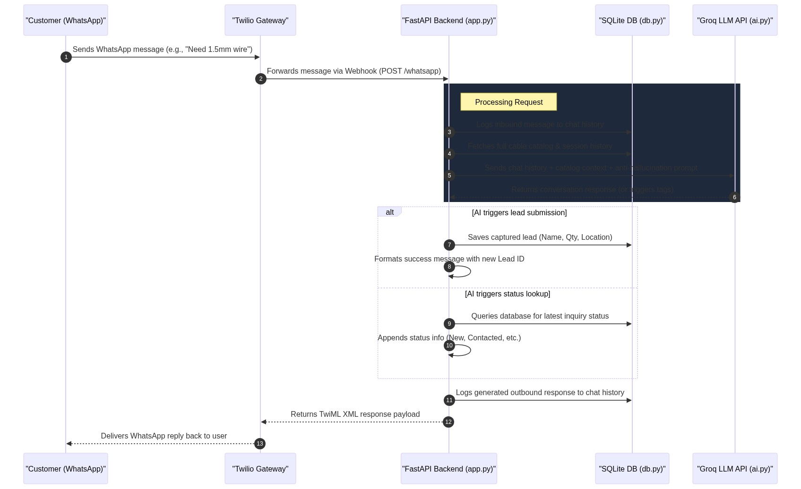

# KDI Power AI WhatsApp Bot Architecture

This document describes the workflow of the AI-powered KDI Power WhatsApp Assistant.

## 📊 Workflow Sequence Diagram

The following sequence diagram shows how an incoming customer message is routed, processed by the AI with catalog context, and replied to.

---

## 🔍 Core Components Explained Simply

1. **FastAPI Webhook Gateway (`app.py`)**:
   - Actively listens for incoming messages from Twilio.
   - Decides what actions to perform based on whether the AI returned special intercept tags (like saving a lead to the database or pulling lead status).
2. **SQLite Database Helper (`db.py`)**:
   - A lightweight database that stores the KDI Power cable product specs/prices, logs lead contact details, and maintains persistent chat histories for every customer phone number.
3. **AI Integration Module (`ai.py`)**:
   - Reads the Groq API key from your `.env` file and calls the high-speed Llama-3.3 model.
   - Injects the system prompts, safety/anti-hallucination rules, product catalog, and chat history context so that the AI responds naturally and accurately.
